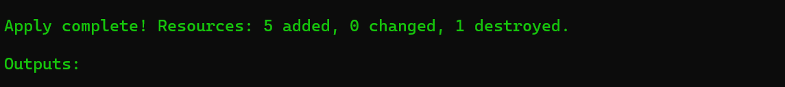
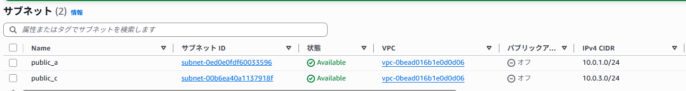
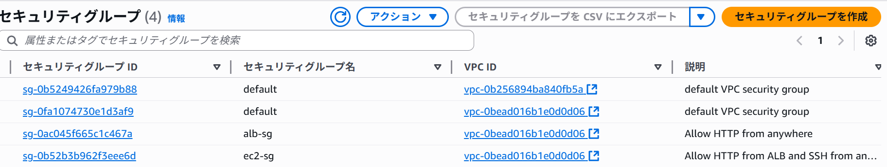
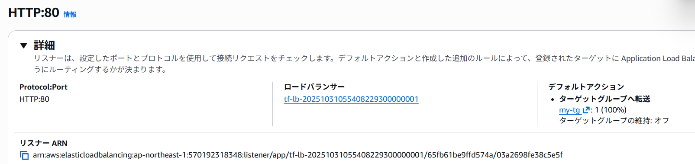
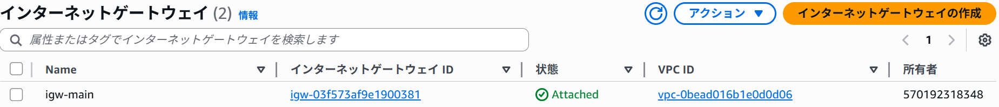
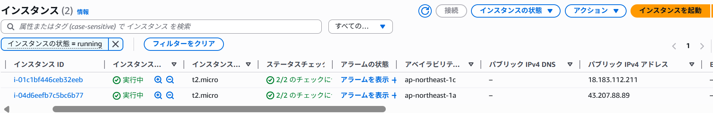
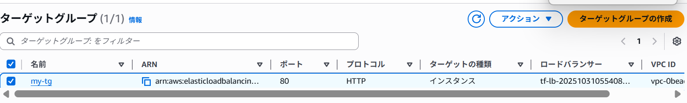
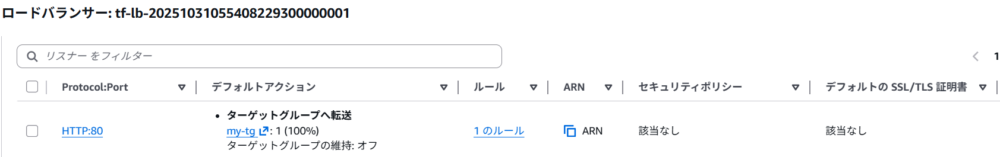
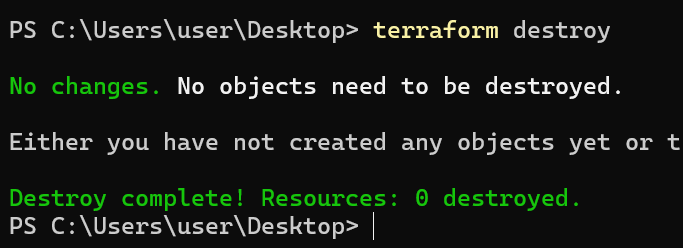

# Terraform ALB & Auto Scaling ポートフォリオ

## 目的

このプロジェクトの目的は、Terraform を用いて AWS 上に以下の構成をコードで自動構築することです：

- VPC + Public Subnet
- Internet Gateway (IGW)
- EC2 インスタンス（Auto Scaling 対応）
- Application Load Balancer (ALB）
- Security Group 設定
- ターゲットグループと Listener の設定

クラウド環境の自動構築を通じて、Terraform の基本操作と AWS インフラの理解を深めることを狙いとしています。

---

## 使用スタック

| 技術           | 用途・内容                                      |
|----------------|--------------------------------------------------|
| Terraform      | インフラ構成のコード管理（IaC）                  |
| AWS EC2        | Web サーバーとしての仮想マシン                    |
| AWS VPC        | ネットワークの基盤構成                           |
| AWS Subnet     | パブリックサブネットの設計                       |
| AWS IGW        | インターネットアクセスのためのゲートウェイ       |
| AWS ALB        | HTTP リクエストの負荷分散                        |
| Auto Scaling   | EC2 インスタンスの自動スケーリング               |
| Security Group | SSH / HTTP アクセス制御                          |
| GitHub         | コードと成果物のバージョン管理・公開             |

---

## 学び

- Terraform によるインフラ構成のコード管理（IaC）
- AWS VPC / Subnet / IGW のネットワーク設計
- Security Group によるアクセス制御（SSH / HTTP）
- EC2 インスタンスの起動と Web サーバー構成
- Auto Scaling による可用性の向上
- ALB とターゲットグループの連携とヘルスチェック設定
- GitHub によるコードと成果物の管理方法

---

## 工夫した点

- Security Group は必要最低限のポート（SSH:22 / HTTP:80）のみ許可
- リソース名や Subnet 名は一目でわかるよう命名規則を統一
- Target Group と Listener の紐付けを明示的に設定
- `.terraform/` や `.tfstate` は Git 管理対象外とし、スクリーンショットとコードのみをアップロード
- スクリーンショットは提出用に整理・リネームし、README に反映

---

## スクリーンショット一覧（構築順）

### 1. Terraform Apply 完了画面  
  
Terraform によるリソース作成が正常に完了したことを示す出力結果。すべての構成がコードで自動化されていることを証明。

### 2. VPC / Subnet 構成の全体確認  
  
VPC と Subnet の構成全体を俯瞰。CIDR や AZ、ルートテーブルとの関連が確認できます。

### 3. VPC の作成確認  
  
Terraform により作成された VPC の詳細。CIDR ブロックや関連リソースが確認できます。

### 4. Public Subnet の確認  
  
VPC 内に作成されたパブリックサブネットの設定。AZ やルートテーブルとの関連も確認。

### 5. Internet Gateway のアタッチ確認  
  
IGW が VPC にアタッチされていることを確認。インターネットアクセスのために必要な構成。

### 6. セキュリティグループ HTTP/SSH 設定  
  
HTTP（ポート80）と SSH（ポート22）のインバウンドルールを設定したセキュリティグループの詳細。

### 7. EC2 インスタンスの起動確認  
  
Auto Scaling により起動された EC2 インスタンスのステータスと詳細情報。ALB のターゲットとして登録される。

### 8. ターゲットグループの構成確認  
  
ターゲットグループの構成と、登録された EC2 インスタンスのヘルスチェック状態を表示。

### 9. ALB Listener 設定  
  
ALB に設定されたリスナーの構成。HTTP リクエストをターゲットグループにルーティングする設定を確認。

### 10. Terraform Destroy 完了画面  
  
構築後のリソースを Terraform によりクリーンアップしたことを示す出力結果。環境の破棄もコードで管理。

---

## 次回に向けて

- ALB のターゲットが `unhealthy` になる原因の検証（Web サーバー設定やヘルスチェック URL の調整）
- Terraform モジュール化の実践（VPC / EC2 / ALB を分けて管理し、再利用性を向上）
- GitHub に大きなファイルを含めず push する方法の改善（Git LFS などの活用）
- Terraform Apply 後の自動 Destroy / クリーンアップの手順の整理
- EC2 に対する SSH 接続の自動化（Ansible や cloud-init の活用）

---